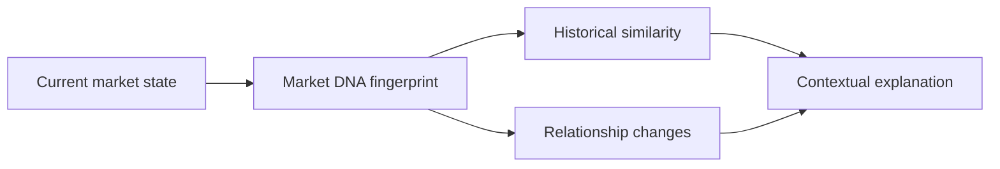
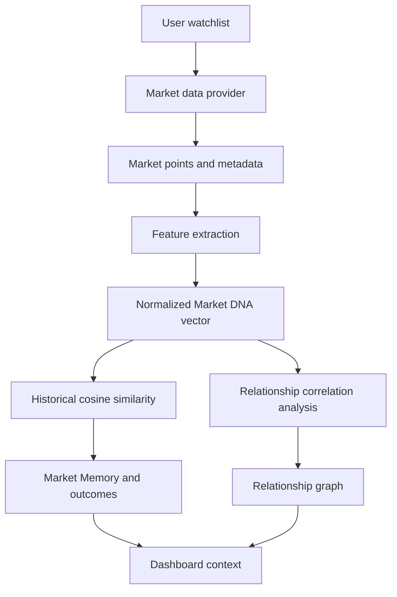
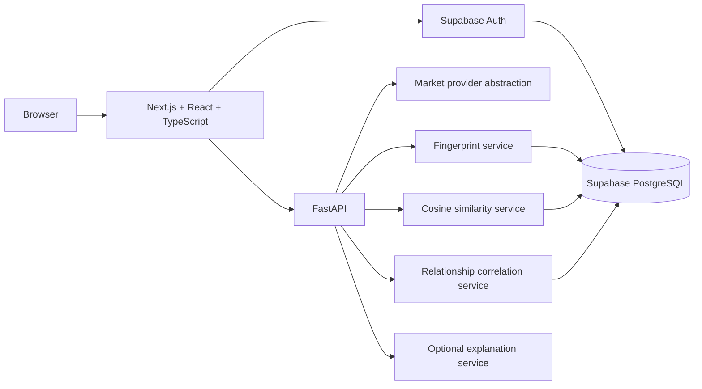

# Market Doppelgänger

> **Don't just watch stocks. Watch patterns.**

Market Doppelgänger is a Smart Market Watchlist prototype for the CODE 2026 / Code by Groww hackathon. Instead of stopping at price movement, it builds contextual market fingerprints, compares current states with deterministic historical events, and surfaces changing relationships between stocks. The product is designed to explain market information, not provide financial advice or guaranteed predictions.

[](https://nextjs.org/)
[](https://react.dev/)
[](https://www.typescriptlang.org/)
[](https://www.python.org/)
[](https://fastapi.tiangolo.com/)
[](https://supabase.com/)

| Item | Current status |
| --- | --- |
| Project type | Full-stack market intelligence prototype |
| Hackathon | CODE 2026 / Code by Groww |
| Status | Demo-ready prototype; authenticated persistence requires Supabase configuration |
| Primary purpose | Add behavioral and historical context to a stock watchlist |
| Architecture | Next.js frontend, FastAPI backend, Supabase Auth/PostgreSQL |

## Why It Matters in 30 Seconds

Market Doppelgänger is a Smart Market Watchlist for CODE 2026 / Code by Groww. A traditional watchlist tells you that a price moved; this prototype adds context about **how** the stock behaved, **which relationships changed**, and **whether a similar market state appeared before**.

Its core idea is **Market DNA**: a stock's current state becomes a multidimensional fingerprint made from price return, momentum, volume anomaly, volatility, benchmark context, and sector context. The system then finds historical Doppelgängers using cosine similarity and explains stock-to-stock relationship changes with rolling return correlations.

This is useful for the hackathon because it turns a familiar watchlist workflow into an explainable market-intelligence workflow without pretending to predict prices or recommend trades.

## Why It's Different

| Traditional Watchlist | Market Doppelgänger |
| --- | --- |
| Shows price movement | Explains behavioral movement through Market DNA |
| User manually scans changes | Surfaces structured anomaly and relationship signals |
| Looks at individual stocks | Looks at stock-to-stock return relationships |
| Little historical context | Matches current vectors with historical market events |
| Static watchlist | Context-aware dashboard and relationship graph |
| Numbers without explanation | Structured facts, historical context, and interpretation |

## Core Idea



The deterministic engines calculate the numbers. The optional explanation layer only turns supplied facts into language and falls back to deterministic templates when no LLM is configured.

## 30-Second Demo

Open [`/demo`](http://localhost:3000/demo) after starting the frontend. The public deterministic walkthrough does not require Supabase, authentication, or a live market provider.

It shows:

1. **Before you checked:** RELIANCE `+0.4%`, ONGC `+0.2%`, correlation `0.31`.
2. **Market changed:** RELIANCE `+5.8%`, ONGC `+4.9%`, correlation `0.78`, and higher volume.
3. **What changed:** price, volume, and relationship anomalies.
4. **Historical pattern:** a `94%` similar historical event.
5. **What happened afterward:** 1D, 3D, and 5D historical outcome summaries with sample size `18`.

Use **Reset** to return to the first stage and **Run demo** to replay the sequence.

## What a User Sees

The authenticated dashboard currently provides:

- A pulse-style dashboard headed **YOUR WATCHLIST CHANGED SHAPE.**
- Market status, freshness, and watchlist-scope indicators.
- Supabase-backed watchlist creation, rename, deletion, and stock management when configured.
- Market DNA feature bars with source, timestamp, demo, stale, and persistence states.
- Historical Doppelgänger matches with similarity and 1D/3D/5D historical outcomes.
- A clickable relationship graph showing current correlation, historical baseline, change, confidence, and relationship type.
- Loading skeletons, empty states, success notices, error states, and responsive layouts.

The dashboard's “Since your last check” panel establishes a baseline, compares later check-ins against the previous visit, and shows only threshold-crossing meaningful changes. A first check-in creates the baseline without reporting changes.

## Capability Status

| Capability | Status |
| --- | --- |
| Authentication | **Implemented** |
| Smart Watchlists | **Implemented** |
| Market DNA | **Implemented** |
| Historical Doppelgänger | **Implemented** |
| Relationship Intelligence | **Implemented** |
| Demo Mode | **Implemented** |
| AI Explanation | **Implemented** |
| Since You Last Checked | **Implemented** |
| Context Discovery | **In Progress** |

> **Status key:** **Implemented** means the current repository has working code for the capability. **In Progress** means related schema, UI, or supporting logic exists, but the complete user-facing workflow is not wired end to end. **Planned** items are described in the later technical sections and are not presented as current functionality.

## Contents

- [Problem Statement](#problem-statement)
- [Our Solution](#our-solution)
- [What Makes It Different](#what-makes-it-different)
- [Key Features](#key-features)
- [How It Works](#how-it-works)
- [Architecture](#architecture)
- [Technology Stack](#technology-stack)
- [Project Structure](#project-structure)
- [Database Design](#database-design)
- [Market DNA](#market-dna)
- [Historical Doppelgänger Engine](#historical-doppelgänger-engine)
- [Relationship Intelligence](#relationship-intelligence)
- [Since You Last Checked](#since-you-last-checked)
- [Demo Mode](#demo-mode)
- [Getting Started](#getting-started)
- [Environment Variables](#environment-variables)
- [API Documentation](#api-documentation)
- [Authentication and Security](#authentication-and-security)
- [Data Quality and Reliability](#data-quality-and-reliability)
- [Explainability](#explainability)
- [Screenshots](#screenshots)
- [Example User Journey](#example-user-journey)
- [Hackathon Value Proposition](#hackathon-value-proposition)
- [Limitations](#limitations)
- [Future Improvements](#future-improvements)
- [Testing](#testing)
- [Development Commands](#development-commands)
- [Contributing](#contributing)
- [License](#license)
- [Disclaimer](#disclaimer)

## Problem Statement

Traditional watchlists are good at answering one narrow question: did the price move up or down? They are less effective at answering what changed around that movement.

That creates several problems:

- Price-only monitoring produces information overload.
- Users must manually decide which movements deserve attention.
- A stock can move with its sector, benchmark, or peers, but a basic watchlist does not show that context.
- It is difficult to distinguish stock-specific movement from broader market movement.
- Unusual changes in relationships between stocks are easy to miss.
- Historical market situations are rarely connected to the current state in an explainable way.

Market Doppelgänger treats a watchlist as a context problem rather than a list of colored price numbers.

## Our Solution

The implemented system represents a stock's recent market state as a normalized multidimensional fingerprint called **Market DNA**. The fingerprint combines price behavior, volume, volatility, benchmark context, and sector context.

The current pipeline is:



The current application also includes a public deterministic Demo Mode and an optional explanation layer. Demo Mode is independent of authentication and external market APIs so the core story can be shown reliably during a hackathon presentation.

## What Makes It Different

### Market DNA / Market Fingerprint

**User problem:** A price change alone does not say whether the move is unusual in context.

**What the system does:** It calculates eight bounded normalized features and returns them as named values plus a numerical vector.

**Why it helps:** A multidimensional state can describe price, volume, volatility, sector, and benchmark context together.

**Status:** Implemented.

### Historical Doppelgänger Matching

**User problem:** Even when a pattern looks unusual, it is hard to know whether a similar market state has appeared before.

**What the system does:** It compares the current normalized vector against stored or deterministic historical event vectors using cosine similarity and returns the top five matches.

**Why it helps:** Historical outcomes provide descriptive context around similar situations without claiming to predict the future.

**Status:** Implemented.

### Relationship Intelligence

**User problem:** Two stocks can move together or apart in a way that a price-only view does not explain.

**What the system does:** It compares recent return correlation with an earlier baseline, classifies the relationship, and renders a clickable relationship graph.

**Why it helps:** A relationship change can be more informative than two independent green numbers.

**Status:** Implemented for deterministic provider data and the configured live-provider contract.

### Market Context Discovery

**User problem:** A user may not know which surrounding stocks provide useful context.

**What the system does:** The current repository contains related-symbol groups inside the relationship engine, but it does not expose a separate `/api/context/{symbol}` endpoint or a completed context-discovery workflow.

**Status:** In Progress / planned. Do not treat this as a completed feature.

### Since You Last Checked

**User problem:** Users need a concise summary of what changed since their previous visit.

**What the system does:** The dashboard contains a placeholder section and the database contains `user_visits` and `detected_changes` tables, but no current API route records visits or computes a real comparison.

**Status:** In Progress / planned. The current dashboard does not yet implement the complete workflow.

### Market Memory

**User problem:** Historical events are difficult to search and compare manually.

**What the system does:** It loads historical events, ranks them by cosine similarity, and aggregates 1-day, 3-day, and 5-day outcomes for the top matches.

**Status:** Implemented.

### Demo Mode

**User problem:** A hackathon demonstration should not depend on a live market producing an interesting event.

**What the system does:** It presents a fixed before/after scenario for RELIANCE and ONGC, including price, volume, correlation, anomaly signals, a historical pattern, and outcomes.

**Status:** Implemented at `/demo`.

### Explanation Layer

**User problem:** Numerical signals can be difficult to communicate quickly.

**What the system does:** It converts validated structured facts into three text buckets: observed facts, historical context, and interpretation. An optional server-side LLM can provide the language, but deterministic templates are used when the LLM is unavailable.

**Status:** Implemented, with deterministic fallback as the default when no LLM configuration exists.

## Key Features

### Authentication and Smart Watchlists

The authenticated frontend supports:

- Supabase Auth sign-in
- Supabase Auth sign-up
- Sign-out
- Session-aware server route protection
- Create watchlist
- Rename watchlist
- Delete watchlist
- Add stock symbols
- Remove stock symbols
- User-owned watchlist queries through Supabase RLS

The current repository requires Supabase credentials and a migrated database for this flow to run.

### Market Fingerprint

The backend extracts these current features:

- `price_return`
- `momentum`
- `volume_anomaly`
- `volatility`
- `benchmark_relative_strength`
- `sector_relative_strength`
- `sector_momentum`
- `benchmark_momentum`

Each feature is bounded to a normalized range from `0` to `1` by the current prototype calculations.

### Historical Doppelgänger

The historical engine:

- Loads up to 100 events for a symbol when Supabase persistence is available.
- Creates 12 deterministic demo events when historical persistence is unavailable.
- Compares current and historical vectors using cosine similarity.
- Returns the top five matches.
- Identifies the three smallest feature differences as matching features.
- Keeps future outcomes in separate historical-event fields.
- Aggregates median return, mean return, positive frequency, and sample size for 1-day, 3-day, and 5-day windows.

Historical outcomes are not used to construct the current fingerprint. **Historical similarity is contextual evidence, not a guaranteed prediction.**

### Relationship Intelligence

The relationship engine:

- Calculates return series from provider price points.
- Calculates recent correlation using a recent window of up to 10 returns.
- Calculates a historical baseline from earlier returns when enough history exists.
- Computes `correlation_change` as current correlation minus baseline correlation.
- Classifies relationships as `unusual synchronization`, `divergence`, `correlation increase`, `correlation decrease`, or `stable relationship`.
- Produces a confidence value and significance flag.
- Persists significant relationships when the backend service-role client is configured.
- Feeds the frontend relationship graph, where nodes can be selected for an explanation.

The engine describes observed movement. It does not infer causation.

### Market DNA, Market Memory, and Relationship UI

The authenticated dashboard contains:

- Market DNA feature bars
- Historical Market Doppelgänger comparison
- Historical outcome cards
- Relationship graph with clickable nodes
- Data source and stale-data indicators
- Loading, empty, success, and error states

The public Demo Mode has a separate guided walkthrough optimized for a short presentation.

## How It Works

The currently implemented path is:

1. The user reaches the auth page or the public Demo Mode.
2. Supabase Auth handles sign-in/sign-up when frontend credentials are configured.
3. The protected dashboard checks the session server-side.
4. The browser loads user-owned watchlists from Supabase.
5. The FastAPI backend selects a live provider when `MARKET_DATA_API_URL` exists; otherwise it uses deterministic demo market data.
6. Provider points include source, timestamp, stale status, delay seconds, and demo status.
7. The fingerprint service calculates the eight normalized features and vector.
8. The persistence service attempts to store a market snapshot and fingerprint through Supabase service-role access.
9. The historical memory service loads stored events or creates deterministic demo events.
10. The similarity service ranks historical vectors using cosine similarity.
11. The relationship service compares rolling return correlations with historical baselines.
12. An authenticated check-in records a visit, establishes a snapshot cutoff, compares current fingerprints with the previous visit, scores meaningful changes, and persists detected changes.
13. The frontend renders Market DNA, historical context, relationship explanations, and since-last-check results.
14. The optional explanation endpoint turns supplied facts into natural-language sections or returns deterministic fallback text.

The following requested stages are not currently wired end to end:

- Dedicated context-discovery endpoint
- User-preference reads and writes

Visit recording, baseline comparison, and meaningful-change persistence are implemented through the authenticated visit check-in endpoints. The remaining items are still planned.

## Architecture



### Frontend

- Next.js App Router
- React
- TypeScript
- Tailwind CSS v4
- `lucide-react` icons
- Supabase SSR/browser clients
- Typed API client

### Backend

- Python
- FastAPI
- Pydantic models
- Uvicorn
- Provider protocols and adapters
- Service modules for fingerprinting, similarity, relationships, persistence, demo data, and explanations

### Database and Auth

- Supabase Auth
- Supabase PostgreSQL
- Supabase JavaScript/Python clients
- SQL migrations under `supabase/migrations`
- RLS policies for user-owned tables

No Pandas, NumPy, scikit-learn, Recharts, or ML framework is present in the current dependency manifests.

No deployment configuration for Vercel, Render, Railway, or another hosting provider is present in the repository.

## Technology Stack

| Layer | Technology | Purpose |
| --- | --- | --- |
| Frontend framework | Next.js 16.3.4 | App Router and web application runtime |
| Frontend UI | React 19.2 | Interactive components |
| Frontend language | TypeScript | Typed client code |
| Styling | Tailwind CSS 4 | Responsive interface styling |
| Icons | lucide-react | UI icons and graph affordances |
| Auth client | `@supabase/ssr`, `@supabase/supabase-js` | Browser/server Supabase Auth and database access |
| Backend framework | FastAPI | HTTP API and validation |
| Backend language | Python 3.12 environment | API and intelligence services |
| Validation | Pydantic / pydantic-settings | Request, response, and environment models |
| Backend server | Uvicorn | Local ASGI server |
| Database | Supabase PostgreSQL | Auth-linked persistence and market data storage |
| SQL extension | `pgcrypto` | UUID generation via `gen_random_uuid()` |

## Project Structure

```text
PROJECT/
├── backend/
│   ├── app/
│   │   ├── api/
│   │   │   ├── demo.py
│   │   │   ├── explanation.py
│   │   │   ├── fingerprints.py
│   │   │   ├── memory.py
│   │   │   └── relationships.py
│   │   ├── providers/
│   │   │   ├── demo.py
│   │   │   ├── factory.py
│   │   │   ├── live.py
│   │   │   ├── market.py
│   │   │   └── news.py
│   │   ├── schemas/
│   │   ├── services/
│   │   │   ├── database.py
│   │   │   ├── demo.py
│   │   │   ├── explanation.py
│   │   │   ├── fingerprint.py
│   │   │   ├── fingerprint_repository.py
│   │   │   ├── historical_repository.py
│   │   │   ├── relationship_repository.py
│   │   │   ├── relationships.py
│   │   │   └── similarity.py
│   │   ├── config.py
│   │   └── main.py
│   ├── tests/
│   ├── .env.example
│   ├── README.md
│   └── requirements.txt
├── frontend/
│   ├── src/
│   │   ├── app/
│   │   │   ├── auth/
│   │   │   ├── dashboard/
│   │   │   ├── demo/
│   │   │   └── page.tsx
│   │   ├── components/
│   │   │   ├── auth/
│   │   │   ├── dashboard/
│   │   │   ├── demo/
│   │   │   └── ui/
│   │   ├── lib/
│   │   │   ├── supabase/
│   │   │   ├── api-client.ts
│   │   │   └── demo-data.ts
│   │   └── types/
│   ├── middleware.ts
│   ├── .env.example
│   ├── package.json
│   └── tsconfig.json
├── supabase/
│   └── migrations/
│       ├── 202609040001_initial_schema.sql
│       └── 202609040002_add_fingerprint_vector.sql
├── .gitignore
└── README.md
```

## Database Design

The repository includes these SQL tables:

| Table | Purpose | Current application use |
| --- | --- | --- |
| `users` | Profile row linked to `auth.users` | Required as the parent of `watchlists.user_id`; populated by an Auth trigger |
| `watchlists` | User-owned watchlists | Read and written by the frontend dashboard |
| `watchlist_stocks` | Symbols in each watchlist | Read and written by the frontend dashboard |
| `user_visits` | Check-in timestamps and snapshot cutoff | Used by the authenticated check-in workflow |
| `market_snapshots` | Provider observations and freshness metadata | Written by fingerprint persistence |
| `market_fingerprints` | Named features, vector, and quality metadata | Written by fingerprint persistence |
| `historical_events` | Historical fingerprints and future outcomes | Read/seeded by Market Memory |
| `detected_changes` | User-owned meaningful-change records | Written by the authenticated check-in workflow |
| `relationships` | Significant stock-pair relationship observations | Written by relationship persistence |
| `data_sources` | Provider status metadata | Schema exists; no current service uses it |
| `user_preferences` | User-owned scoring/demo preferences | Schema exists; no current service uses it |

Important relationships:

- `users.id` references `auth.users.id`.
- `watchlists.user_id` references `users.id`.
- `watchlist_stocks.watchlist_id` references `watchlists.id`.
- `user_visits.user_id` references `users.id`.
- `user_visits.watchlist_id` references `watchlists.id`.
- `detected_changes.user_id` references `users.id`.
- `detected_changes.watchlist_id` references `watchlists.id`.
- `detected_changes.baseline_visit_id` references `user_visits.id`.
- `user_preferences.user_id` references `users.id`.
- `market_fingerprints.snapshot_id` references `market_snapshots.id`.

Important indexes include:

- `watchlists(user_id, updated_at DESC)`
- `user_visits(user_id, watchlist_id, checked_at DESC)`
- `market_snapshots(symbol, observed_at DESC)`
- `market_fingerprints(symbol, calculated_at DESC)`
- `detected_changes(user_id, detected_at DESC)`
- Unique indexes from watchlist-symbol, relationship, historical-event, and data-source constraints

RLS is enabled in the current initial migration for `users`, `watchlists`, `watchlist_stocks`, `user_visits`, `detected_changes`, and `user_preferences`. The private-table policies use `auth.uid()` and watchlist ownership checks. The current migration does not enable RLS on market-wide tables such as `market_snapshots`, `market_fingerprints`, `relationships`, `historical_events`, or `data_sources`.

The backend persistence services use the server-only Supabase service-role client when configured. The service-role credential must never be exposed to the frontend.

## Market DNA

A stock state is represented by a normalized vector:

$$
F = [
\text{price return},
\text{momentum},
\text{volume anomaly},
\text{volatility},
\text{benchmark relative strength},
\text{sector relative strength},
\text{sector momentum},
\text{benchmark momentum}
]
$$

The actual feature names in code are:

```text
price_return
momentum
volume_anomaly
volatility
benchmark_relative_strength
sector_relative_strength
sector_momentum
benchmark_momentum
```

The prototype bounds feature values to `[0, 1]`. Price returns and momentum use centered bounded scores. Volume anomaly compares the latest volume with a baseline. Volatility uses population standard deviation over stock returns. Relative-strength features compare stock return with benchmark or sector return.

The fingerprint is more informative than price alone because it combines magnitude, recent direction, activity, volatility, and contextual movement. Two stocks with similar price changes may have very different volume, volatility, sector, and benchmark relationships.

## Historical Doppelgänger Engine

The current historical matching flow is:

```text
Current market state
        ↓
Current normalized fingerprint
        ↓
Compare with historical fingerprint vectors
        ↓
Rank by cosine similarity
        ↓
Return top five historical events
        ↓
Aggregate 1D / 3D / 5D outcomes
        ↓
Present contextual historical evidence
```

The implementation uses cosine similarity:

$$
\text{similarity}(A,B) =
\frac{A \cdot B}{\lVert A \rVert \lVert B \rVert}
$$

The result is bounded to `[0, 1]` by the current implementation. The three smallest absolute feature differences are returned as the matching-feature explanation.

Historical events contain:

- Symbol
- Event date
- Stored features and vector
- Future 1-day return
- Future 3-day return
- Future 5-day return
- Source
- Demo-data flag at the application model level

The current repository keeps future outcomes separate from the current fingerprint input. Future returns are used only after historical events have been selected. Historical similarity is contextual evidence, not a guaranteed prediction.

When Supabase persistence is unavailable, the repository creates 12 deterministic historical demo events for the requested symbol. When persistence is configured, it first queries stored events and seeds demo events only when no rows exist.

## Relationship Intelligence

The relationship engine calculates Pearson correlation over aligned return series.

For a pair of stocks it produces:

- Current correlation over a recent window of up to 10 returns
- Historical baseline correlation over earlier returns when enough history exists
- `correlation_change = current correlation - historical correlation`
- Similarity, mapped from correlation to a `[0, 1]` scale
- Relationship type
- Confidence
- Significance flag
- Stale/demo/source metadata

Relationship classifications include:

- `unusual synchronization`
- `divergence`
- `correlation increase`
- `correlation decrease`
- `stable relationship`

Example:

```text
Stock A and Stock B normally have weak correlation.
Their recent return correlation becomes much stronger.
The application surfaces a relationship change rather than only showing two positive prices.
```

The frontend relationship graph renders stocks as nodes and relationships as edges. Selecting a node shows current correlation, historical baseline, change, confidence, and a non-causal explanation.

The current implementation uses deterministic related-symbol groups for known symbols. It does not implement a separate general context-discovery API.

## Since You Last Checked

The intended product flow is:

```text
First visit
    ↓
Establish baseline
    ↓
User leaves
    ↓
Market changes
    ↓
User returns
    ↓
Compare against previous state
    ↓
Surface meaningful changes
```

The authenticated check-in workflow records the newest visit, uses its snapshot cutoff as the next baseline, compares current fingerprints with the previous visit's stored fingerprints, and persists only changes at or above the deterministic `0.35` threshold. Historical future outcomes are not used in the meaningful-change score.

## Demo Mode

Run the frontend and open:

```text
http://localhost:3000/demo
```

The public Demo Mode does not require Supabase authentication or an external market provider. It uses deterministic data and a staged walkthrough:

1. Before you checked
2. Market changed
3. Here's what changed
4. Here's the historical pattern
5. Here's what happened in similar situations

The controlled scenario includes:

- RELIANCE: `+0.4%` before and `+5.8%` after
- ONGC: `+0.2%` before and `+4.9%` after
- Correlation: `0.31` before and `0.78` after
- Price anomaly
- Volume anomaly
- Relationship anomaly
- Historical similarity: `94%`
- Historical event date: `2024-07-18`
- Historical sample size: `18`
- Historical 1D, 3D, and 5D outcomes
- Deterministic explanation fallback

The backend also exposes the fixed scenario at:

```text
GET /api/demo/scenario
```

The public demo is the reliable presentation path. It is separate from the authenticated watchlist dashboard.

## Getting Started

### Prerequisites

The repository currently requires:

- Node.js and npm
- Python 3.12 is the verified local interpreter
- A Supabase project for authentication and persistence testing
- Git, if cloning the repository

No Node.js version is declared in `package.json` or an engines file.

### Clone

```bash
git clone <YOUR_REPOSITORY_URL>
cd <YOUR_REPOSITORY_NAME>
```

### Frontend Setup

```powershell
cd frontend
npm install
Copy-Item .env.example .env.local
npm run dev
```

Open [http://localhost:3000](http://localhost:3000).

Available frontend scripts:

```powershell
npm run dev
npm run build
npm run start
npm run lint
```

There is no frontend test script in `package.json`.

### Backend Setup on Windows PowerShell

```powershell
cd backend
py -3.12 -m venv .venv
.\.venv\Scripts\Activate.ps1
python -m pip install -r requirements.txt
Copy-Item .env.example .env
uvicorn app.main:app --reload --port 8000
```

The backend application entry point is `app.main:app`.

If the shell is not already in `backend`, use an explicit app directory:

```powershell
& 'D:\PROJECT\backend\.venv\Scripts\python.exe' -m uvicorn app.main:app --app-dir 'D:\PROJECT\backend' --reload --port 8000
```

### Supabase Setup

1. Create a Supabase project.
2. Run the repository migrations in order from `supabase/migrations`.
3. Configure Supabase Auth email/password settings as needed for the sign-in/sign-up flow.
4. Configure the frontend public URL and anon key in `frontend/.env.local`.
5. Configure backend Supabase URL and service-role key in `backend/.env`.
6. Never commit `.env` or `.env.local`.
7. Start the frontend and backend using the commands above.

The service-role key is server-only. Do not use a `NEXT_PUBLIC_` prefix for it.

## Environment Variables

### Frontend

```text
NEXT_PUBLIC_API_URL=
NEXT_PUBLIC_SUPABASE_URL=
NEXT_PUBLIC_SUPABASE_ANON_KEY=
```

These variables are used by the frontend API client and Supabase browser/server clients. They are public configuration values; they are not substitutes for the backend service-role credential.

### Backend

```text
APP_NAME=
ENVIRONMENT=
FRONTEND_ORIGINS=
SUPABASE_URL=
SUPABASE_ANON_KEY=
SUPABASE_SERVICE_ROLE_KEY=
DATABASE_URL=
MARKET_DATA_API_URL=
MARKET_DATA_API_KEY=
MARKET_DATA_TIMEOUT_SECONDS=
MARKET_DATA_STALE_AFTER_SECONDS=
FINGERPRINT_FEATURE_VERSION=
LLM_API_URL=
LLM_API_KEY=
LLM_MODEL=
LLM_TIMEOUT_SECONDS=
```

Current usage notes:

- `SUPABASE_URL` and `SUPABASE_SERVICE_ROLE_KEY` are required for backend persistence paths.
- `SUPABASE_ANON_KEY` is supported by the backend client helper but is not used by the active persistence repositories.
- `DATABASE_URL` is declared but not consumed by current code.
- `MARKET_DATA_API_URL` selects the live provider; when empty, the demo provider is selected.
- `MARKET_DATA_API_KEY` is sent as a server-side bearer token to the configured market provider.
- `MARKET_DATA_STALE_AFTER_SECONDS` controls live-provider stale classification.
- `LLM_API_URL` and `LLM_API_KEY` enable the optional LLM explanation adapter. Without them, deterministic fallback text is used.
- `LLM_TIMEOUT_SECONDS` controls the LLM request timeout.

Never commit `.env`, `.env.local`, service-role keys, market API keys, LLM API keys, or other secrets. The root `.gitignore` ignores `.env` and `.env.local`; the frontend ignore file ignores `.env*`.

## API Documentation

The FastAPI application registers these routes:

| Method | Endpoint | Purpose | Auth in current route code |
| --- | --- | --- | --- |
| `GET` | `/health` | API health response | None |
| `GET` | `/api/fingerprint/{symbol}` | Generate and optionally persist a current fingerprint | No FastAPI auth dependency; persistence uses server configuration |
| `GET` | `/api/market-memory/{symbol}` | Match the current fingerprint with historical events and aggregate outcomes | No FastAPI auth dependency |
| `GET` | `/api/relationships/{symbol}` | Calculate related-stock correlations and relationship changes | No FastAPI auth dependency |
| `POST` | `/api/visits/check-in` | Establish a baseline or compare the current watchlist state with the previous visit | Supabase bearer session required |
| `GET` | `/api/visits/latest/{watchlist_id}` | Restore the latest baseline and meaningful changes for a user's watchlist | Supabase bearer session required |
| `GET` | `/api/demo/scenario` | Return deterministic hackathon demo data | None |
| `POST` | `/api/explanation` | Explain supplied structured facts with optional LLM or deterministic fallback | No FastAPI auth dependency |

### `GET /health`

Example response:

```json
{
  "status": "ok",
  "service": "market-doppelganger-api",
  "version": "0.1.0"
}
```

### `GET /api/fingerprint/{symbol}`

Returns:

```json
{
  "symbol": "RELIANCE",
  "timestamp": "2026-09-04T12:00:00Z",
  "features": {
    "price_return": 0.8,
    "momentum": 0.7
  },
  "vector": [0.8, 0.7],
  "data_source": "demo",
  "is_demo_data": true,
  "is_stale": false,
  "delay_seconds": 0,
  "persisted": false
}
```

The actual response includes all eight features and the complete vector.

### `GET /api/market-memory/{symbol}`

Returns the current feature/vector state, up to five historical matches, matching feature names, and 1D/3D/5D aggregates. Historical outcome fields are kept separate from current fingerprint fields.

### `GET /api/relationships/{symbol}`

Returns related symbols with current correlation, historical correlation, correlation change, similarity, relationship type, confidence, significant flag, and source/freshness metadata.

### `POST /api/explanation`

Request fields:

```json
{
  "symbol": "RELIANCE",
  "price_change": 5.8,
  "volume_multiple": 2.4,
  "sector_change": 2.1,
  "correlation_change": 0.47,
  "historical_similarity": 0.94,
  "historical_sample_size": 23
}
```

Response sections:

```json
{
  "observed_facts": "...",
  "historical_context": "...",
  "interpretation": "...",
  "source": "deterministic template",
  "is_fallback": true
}
```

Not currently implemented as routes:

- `/api/context/{symbol}`
- `/api/changes`

## Authentication and Security

The frontend uses Supabase Auth with `@supabase/ssr` and `@supabase/supabase-js`.

- `/auth` provides sign-in and sign-up UI.
- Signup passes `display_name` metadata.
- `/dashboard` checks the server-side session and redirects unauthenticated users to `/auth`.
- Middleware refreshes Supabase session cookies for `/dashboard` and `/auth` routes.
- Browser watchlist operations use the authenticated Supabase client.
- Database RLS policies are intended to restrict user-owned data using `auth.uid()`.
- Backend persistence uses a server-only service-role client when configured.

Never commit `.env`, `.env.local`, service-role keys, market-data keys, LLM keys, passwords, tokens, or other credentials. Never expose `SUPABASE_SERVICE_ROLE_KEY` through a `NEXT_PUBLIC_` variable.

## Data Quality and Reliability

The market-data response model carries:

- `source`
- `timestamp`
- `is_stale`
- `delay_seconds`
- `is_demo_data`

The live provider marks a response stale when its calculated delay exceeds `MARKET_DATA_STALE_AFTER_SECONDS`. It expects a provider response containing a timestamp and points for the stock, benchmark, and sector.

If no `MARKET_DATA_API_URL` is configured, the provider factory selects the deterministic demo provider. If a configured live provider raises an error, fingerprint and relationship routes fall back to demo data and label the response accordingly.

Missing Supabase service-role configuration does not prevent fingerprint calculation, but persistence is reported as unavailable. The current implementation does not provide general conflict-resolution logic for conflicting providers and does not implement a dedicated missing-data reconciliation workflow.

## Explainability

Deterministic services calculate:

- Price return
- Momentum
- Volume anomaly
- Volatility
- Benchmark and sector relative strength
- Fingerprint similarity
- Historical outcome aggregates
- Return correlations
- Relationship changes and classifications

The optional AI layer does not calculate metrics or decide whether a change is meaningful. It receives validated structured facts and produces concise language in three buckets:

- Observed facts
- Historical context
- Interpretation

If the LLM endpoint is missing, times out, fails, returns incomplete JSON, or uses forbidden recommendation/prediction language, the backend returns deterministic template text.

## Screenshots

No screenshot files currently exist in the repository.

Screenshots can be added later, for example:

```text
docs/screenshots/dashboard.png
docs/screenshots/doppelganger.png
docs/screenshots/relationships.png
```

These are placeholders only and are not currently linked as existing image assets.

## Example User Journey

The intended authenticated journey is:

1. User opens the auth page.
2. User signs up or signs in with Supabase Auth.
3. User creates or selects a watchlist.
4. User adds stock symbols.
5. The dashboard loads current Market DNA for the first active stock.
6. The user views historical Doppelgänger matches and outcomes.
7. The user inspects relationship nodes and baseline changes.
8. The user selects **Set baseline** or **Check again** in Since You Last Checked.
9. The system compares current fingerprints with the previous visit and shows meaningful changes or a quiet-state message.
10. The optional explanation layer summarizes supplied facts.

The authenticated check-in journey is implemented through the visit endpoints. Context discovery remains planned.

For the reliable hackathon walkthrough, open `/demo` and run the deterministic scenario.

## Hackathon Value Proposition

Market Doppelgänger goes beyond price tracking by turning raw market observations into context:

- It represents stock behavior as a multidimensional Market DNA vector.
- It compares current states with historical situations.
- It surfaces changing stock relationships through return correlation.
- It separates current facts from future historical outcomes.
- It makes complex calculations understandable through structured explanations.
- It uses deterministic rules and transparent calculations instead of allowing an LLM to decide market significance.
- It keeps humans in control and avoids presenting historical patterns as guaranteed predictions.
- Its deterministic Demo Mode makes the concept understandable within a short hackathon presentation.

## Limitations

The current repository has these limitations:

- Supabase credentials and a deployed Supabase project are not included.
- Authenticated watchlist persistence cannot work until the environment and migrations are configured.
- The live provider depends on an external API with a specific JSON contract.
- No live market provider is configured by default.
- Demo data is deterministic and must not be presented as live data.
- Historical demo data is generated from 12 deterministic events per symbol when persisted history is unavailable.
- The current similarity aggregate uses the top five matches, so sample size is the number of selected matches, not a broad statistical universe.
- Since-last-check comparison requires Supabase Auth, watchlist data, and service-role persistence configuration.
- Context discovery has related-symbol logic but no dedicated context API.
- User preferences remain schema-only; visits and detected changes are used by the check-in service.
- The optional LLM path was not validated against a real provider in this repository.
- No conflict-resolution strategy is implemented for multiple contradictory providers.
- No production deployment configuration is included.

## Future Improvements

The architecture can support future work such as:

- A complete user-visit and meaningful-change engine
- Dedicated context discovery endpoints and UI
- More market-data providers and provider reconciliation
- More historical events and stronger statistical calibration
- Intraday fingerprints
- Sector-level and portfolio-level graph intelligence
- Persistent user scoring preferences
- Streaming market updates
- Better confidence and data-quality presentation
- Production deployment configuration

These are future improvements, not current functionality.

## Testing

The backend uses Python's built-in `unittest` framework. Current tests cover:

- Deterministic demo scenario
- Demo market provider determinism and labeling
- Fingerprint normalization and vector shape
- Stale-data metadata propagation
- Cosine similarity top-five matching
- Historical outcome aggregation
- Correlation and relationship classification
- Deterministic explanation fallback

Run the backend tests from PowerShell:

```powershell
cd backend
$env:PYTHONPATH = (Get-Location).Path
python -m unittest discover -s tests -v
```

The repository currently contains 10 backend tests. No frontend test script is declared in `frontend/package.json`.

## Development Commands

| Area | Command | Purpose |
| --- | --- | --- |
| Frontend | `cd frontend; npm install` | Install frontend dependencies |
| Frontend | `npm run dev` | Start Next.js development server |
| Frontend | `npm run build` | Create production build |
| Frontend | `npm run start` | Start built Next.js application |
| Frontend | `npm run lint` | Run ESLint |
| Backend | `cd backend; py -3.12 -m venv .venv` | Create Python environment |
| Backend | `.\.venv\Scripts\Activate.ps1` | Activate environment in PowerShell |
| Backend | `python -m pip install -r requirements.txt` | Install backend dependencies |
| Backend | `uvicorn app.main:app --reload --port 8000` | Start FastAPI |
| Backend | `python -m unittest discover -s tests -v` | Run backend tests |
| Backend | `python -m compileall app` | Compile-check backend modules |

The frontend uses port `3000` by default. The backend uses port `8000` in the documented local command.

## Contributing

1. Fork the repository.
2. Create a focused branch.
3. Make the smallest change that addresses the issue.
4. Run frontend lint/build checks and backend tests.
5. Open a pull request describing the behavior, validation, and any configuration requirements.

## License

License: Not currently specified.

## Disclaimer

Market Doppelgänger is an educational and analytical market-intelligence prototype. Historical patterns and similarity scores are informational and should not be interpreted as financial advice, investment recommendations, or guaranteed predictions.
